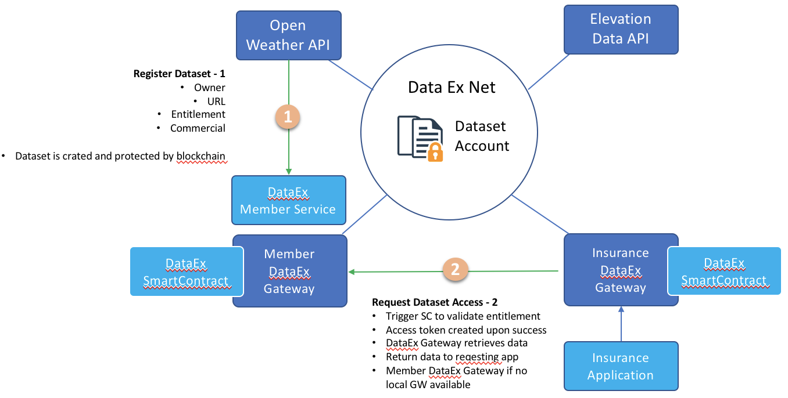

Draft Architecture
==================

The following diagrams describes the interactions between data provider, data consumer and dataex platfrom provider.

We need to clearly define the responsibility of these roles.

## DataEx Platfrom Provider
1. Enable secure dataset related transaction including registration, access, audit, etc.
2. Enable fast and easy dataex network partition, either hosted on prem, in the cloud, or not hosted all
3. Provide ease to use DataEx API for 3rd parth application development

## Data Provider

## Data Consumer

## Code Structure

The code is separated into 2 main categories, the RESTful API and the ChainCode (SmartContract). The RESTful API provides an easy way to interact with the BlockChian network to invoke the ChainCode. While we are using blockchain to protect the "valuables", from functional point of view, we could use any persistence store, SQL or NoSQL. 
We can package the RESTFul API and the ChainCode into one single Docker image for simple deployment. 
